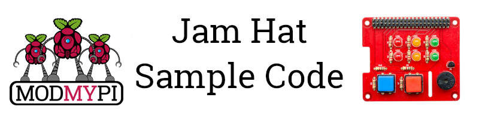

# Jam HAT Sample Code



Welcome to the [Jam HAT](https://www.modmypi.com/jam-hat) repo! Here you'll find example code to get you started with the Jam Hat.

## Assembly
For assembly instructions please refer to our [Getting Started Guide](https://www.modmypi.com/blog/getting-started-with-the-jamhat).

## GPIO Zero Class Available
The Jam Hat has been included in version 1.5 of [GPIO Zero](https://github.com/RPi-Distro/python-gpiozero).

Ensure your version of GPIO Zero is up to date by opening a terminal window and typing:

```
sudo apt-get update
sudo apt-get install python3-gpiozero python-gpiozero
```

From there you can add the Jam Hat into your Python script by using.

```
# Import the JamHat from gpiozero along with sleep from time.
from gpiozero import JamHat
from time import sleep

# Make the JamHat object.
jamhat = JamHat()

# Turn on the JamHat lights and buzzer, wait for 1 second and then turn it off.
jamhat.on()
sleep(1)
jamhat.off()
```

For more usage please refer to the [Getting Started Guide](https://www.modmypi.com/blog/getting-started-with-the-jamhat) or the [GPIO Zero docs](https://gpiozero.readthedocs.io/en/stable/api_boards.html#jamhat).

## Pin Usage
For other projects you may want to use a library like RPi.GPIO in which case you will need to set up the pins by hand. The table below shows the pin numbers for BCM, Board and the matching GPIO Zero objects.

| Component | GPIO.BCM | GPIO.BOARD | GPIO Zero object | Notes |
|---|---|---|---|---|
| LED1 | GPIO 5 | Pin 29 | lights_1.red | |
| LED2 | GPIO 6 | Pin 31 | lights_2.red | |
| LED3 | GPIO 12 | Pin 32 | lights_1.yellow | |
| LED4 | GPIO 13 | Pin 33 | lights_2.yellow | |
| LED5 | GPIO 16 | Pin 36 | lights_1.green | |
| LED6 | GPIO 17 | Pin 11 | lights_2.green | |
| Button 1 | GPIO 19 | Pin 35 | button_1 | Conntected to R8/R10 |
| Button 2 | GPIO 18 | Pin 12 | button_2 | Conntected to R7/R9 |
| Buzzer | GPIO 20 | Pin 38 | buzzer | |

For example to set up the Red LED using RPi.GPIO:

```
# mport the library
import RPi.GPIO as GPIO

# Set the pin mode to be BCM
GPIO.setmode(GPIO.BCM)

# Set LED1 to be an output.
GPIO.setup(5,GPIO.OUT)

# Turn LED1 on.
GPIO.output(5,1)
```

## Example Scripts

There are several scripts here to show you what you can do with the Jam Hat.

### button_led_piezo.py
This sample script shows you how to cycle through the leds, each led having a set pitch, then playing the pitch on the buzzer.

### button_piezo.py
This sample script shows you how to make the buzzer buzz with the push of a button.

### buttons.py
This sample script shows you how to use the buttons to create a simple counter.

### led_ants.py
Walk through the LEDs on the board.

### mario.py
Play the Mario Theme tune via the Buzzer. This currently uses RPi.GPIO but will be transferred over into GPIO Zero soon.
